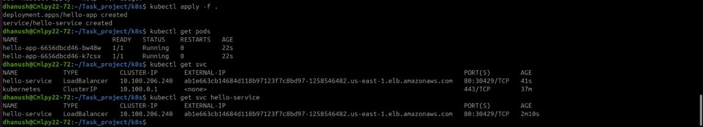

# Automated Kubernetes Deployment using Terraform & GitHub Actions

## Overview
This project demonstrates an end-to-end DevOps workflow to automatically build, containerize, and deploy a simple **"Hello World"** web application to a Kubernetes cluster using modern DevOps practices.

The solution uses:
- **Terraform** for Infrastructure as Code (IaC)
- **Docker** for containerization
- **Kubernetes** for orchestration
- **GitHub Actions** for CI/CD automation
- **AWS EKS** and **Amazon ECR** as the cloud platform

Whenever code is pushed to the `main` branch, the CI/CD pipeline automatically builds the Docker image, pushes it to the container registry, and deploys the application to the Kubernetes cluster.

---

## Architecture
- **Cloud Provider**: AWS  
- **Kubernetes**: Amazon EKS (Managed Cluster)  
- **Container Registry**: Amazon ECR  
- **CI/CD Tool**: GitHub Actions  

---

## Project Structure
.
├── app/ # Hello World web application
├── docker/ # Dockerfile for containerization
├── k8s/ # Kubernetes manifests (Deployment, Service)
├── terraform/ # Terraform IaC for EKS cluster
├── .github/workflows/ # GitHub Actions CI/CD pipeline
└── README.md

yaml
Copy code

---

## Infrastructure as Code (Terraform)
Terraform is used to provision the Kubernetes cluster on AWS.

### Provisioned Resources
- Amazon EKS cluster
- Managed node group
- Networking (VPC and subnets using AWS default VPC)
- IAM roles and policies

### How to Create the Cluster
```bash
cd terraform
terraform init
terraform apply
Containerization (Docker)
The application is containerized using Docker.

Features
Lightweight base image

Optimized Dockerfile

Simple Nginx-based Hello World application

Build Image Locally
bash
Copy code
docker build -t hello-app .
docker run -p 8080:80 hello-app
Kubernetes Deployment
Kubernetes manifests are used to deploy the application to the cluster.

Resources
Deployment: Runs the application pods

Service: Exposes the application publicly using a LoadBalancer

Deploy to Cluster
bash
Copy code
kubectl apply -f k8s/
CI/CD Pipeline (GitHub Actions)
A GitHub Actions pipeline automates the entire build and deployment process.

Pipeline Workflow
Triggered automatically on push to the main branch:

Checkout source code

Configure AWS credentials (via GitHub Secrets)

Build Docker image

Push image to Amazon ECR

Deploy updated application to EKS using kubectl

Security Note
AWS credentials are stored securely using GitHub Actions Secrets.
To avoid unnecessary cloud costs, credentials are not enabled in the public repository.

Live Application URL
When deployed, the application is accessible via the Kubernetes LoadBalancer URL:

cpp
Copy code
http://<EXTERNAL-LOADBALANCER-IP>
Design Choices
Terraform: Enables reproducible and version-controlled infrastructure

GitHub Actions: Lightweight and tightly integrated CI/CD solution

Amazon EKS: Fully managed Kubernetes service reduces operational overhead

LoadBalancer Service: Simple and cloud-native way to expose the application publicly

Future Improvements (Optional)
Use Helm for deployment templating

Add monitoring with Prometheus and Grafana

Integrate container image security scanning

Implement Ingress instead of LoadBalancer
**
### CI/CD Pipeline Execution Note**

The GitHub Actions workflow is fully configured to build, push, and deploy
the application to Amazon EKS.

AWS credentials are intentionally not enabled in the public repository to
prevent unintended cloud resource creation and associated costs.

Once valid AWS credentials are provided via GitHub Actions Secrets, the
pipeline will execute successfully and automatically deploy the application
to the Kubernetes cluster.

## Proof of Deployment

### Terraform – EKS Cluster Creation


### Kubernetes Pods


### Kubernetes Service (LoadBalancer)


### Live Application


Conclusion
This project demonstrates a complete, automated Kubernetes deployment pipeline using industry-standard DevOps tools and practices. The setup is reproducible, scalable, and suitable for production environments with minimal modifications.
